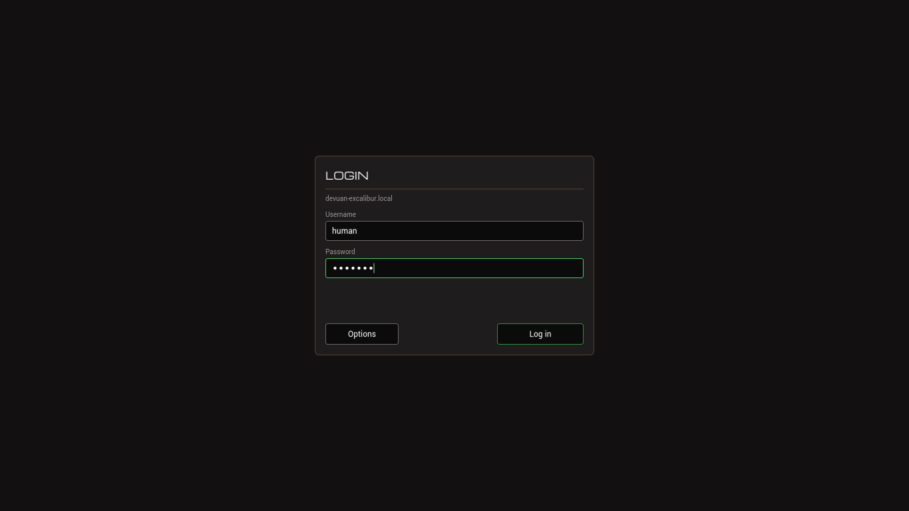

# simple-login-gui

A small graphical login for **Devuan on sysvinit and seatd**. It replaces the text getty on tty1
with one fullscreen window, authenticates with PAM, drops privileges properly and runs the user's
`~/.xinitrc`. On logout the login screen comes back.

No GTK, no Qt, no GLib, no systemd, no display-manager framework. The window is drawn by hand with
**Cairo and FreeType** on plain Xlib. One binary, one PAM stack, one init script.

Works with **seatd alone**. elogind is optional. ConsoleKit2 is not required.



---

## Why

Devuan Excalibur with seatd and no elogind has no login manager that is not either enormous
(LightDM, SDDM) or unmaintained (slim, ldm). This is the small one.

---

## What is on the screen

A centred panel with a username field, a password field and two buttons.

**Log in** authenticates and starts your session.

**Options** opens a menu:

| Entry | What it does |
|---|---|
| **Console** | Switches to a text VT (tty2 by default) and leaves X running. `Alt+F1` comes straight back to the login screen — nothing is torn down and nothing restarts. |
| **Background…** | Lists the images installed in `/usr/local/share/xlogin/backgrounds` and applies one immediately. The choice is saved and survives a reboot. |
| **Restart** | Reboots. Asks for a second click first. |
| **Shut down** | Powers off. Asks for a second click first. |

Everything works from the keyboard as well as the pointer: `Tab` moves username → password →
Options → Log in, `Return` activates, and inside the menu the arrow keys move, `Return` chooses and
`Escape` backs out. That is deliberate — the Options menu is this screen's way out, and a way out
you can only reach with a mouse is no use to somebody whose mouse is the reason they want a
console.

**Options stays available while a login is in progress.** If a PAM module hangs, everything else
on the screen goes grey and that button does not.

> Anyone standing at the keyboard can use Console, Restart and Shut down **without logging in**.
> That is a deliberate decision, not an oversight. See [Threat model](#threat-model) before you
> rely on it.

---

## Requirements

- Devuan Excalibur, or another sysvinit system
- [XLibre](https://x11libre.net/) (recommended) or Xorg, with libseat support
- seatd

Runtime: `libcairo2 libfreetype6 libjpeg62-turbo libx11-6 libxrandr2 libpam0g seatd libseat1
x11-xserver-utils xinit xterm`

Build, if you are building from source: `libcairo2-dev libfreetype-dev libjpeg-dev libx11-dev
libxrandr-dev libpam0g-dev build-essential g++ make`

The installer installs whichever set it needs.

### If you are using the binary release

It is built for one architecture and against one glibc, and both are stated on the download.
The current release needs:

| | |
|---|---|
| architecture | `x86_64` |
| glibc | **>= 2.38** |
| libstdc++ | `GLIBCXX_3.4.29` |

**glibc 2.38 means Excalibur or newer.** Devuan Daedalus and Debian bookworm ship 2.36, and the
binary will not start on them — build from source there instead, which installs exactly the same
way.

You do not have to work this out in advance. `install.sh` **runs the binary before it changes
anything**, and if it will not start it says so and stops with `/etc/inittab` untouched — so a
mismatch costs you a message, not a machine that will not boot.

---

## How it works

```
inittab (tty1)
    └── xlogin-launcher
            ├── starts seatd (if it is not already running)
            ├── starts XLibre/Xorg on :0 with seatd seat management
            └── execs xlogin
                    └── on a successful login: forks, drops privileges,
                        execs ~/.xinitrc as that user on display :0
                        └── on logout: the login screen comes back
```

PAM does all the authentication. The session runs entirely as the logged-in user with a clean,
minimal environment. **The X server stays running between logins**, which is why logging out is
instant and why the Console entry can leave it alone.

---

## Installation

Download the release archive and its checksum, check it, unpack it and run the installer:

```sh
sha256sum -c xlogin-2.0.0-x86_64.sha256
tar -xf xlogin-2.0.0-x86_64.tar.gz
cd xlogin-2.0.0-x86_64
sudo ./install.sh
```

The archive holds the installed tree — the binary, the launcher, the PAM stack, the init script,
the polkit rules and the fonts — plus `install.sh`, `uninstall.sh` and these documents. No
sources and no build system; nothing is compiled on your machine.

**The archive is not relocatable.** The binary has `/usr/local/...` compiled into it for its
fonts, its backgrounds directory and its config, so it is an absolute tree that belongs at `/`.
`install.sh` puts it there. Unpacking it somewhere else and running the binary from there gives
you a login screen with no fonts.

It asks:

1. Which X server you have (XLibre or Xorg)
2. Which user to configure for graphical login
3. Which session to start — it reads `/usr/share/xsessions/`, so any installed WM or DE appears
4. Whether to wrap the session in `dbus-run-session`
5. Optionally, a PNG or JPEG to install as the login background

and then:

- Detects your GPU driver and writes `/etc/xlogin.conf` with the right X server flags
- Checks `/etc/inittab` for a getty to use as the Console target, and warns if there is not one
- Installs the dependencies and builds from source
- Runs `make install`: the binary, the launcher, the PAM stack, the init script, the polkit rules,
  the two bundled fonts and the backgrounds directory
- Enables seatd at boot
- Adds the user to `input`, `video` and `plugdev`
- Writes `~/.xinitrc` and `/etc/skel/.xinitrc`
- Replaces the tty1 getty in `/etc/inittab` with `xlogin-launcher`

Reboot to activate it.

**Re-running the installer is safe.** It reads back your existing `XLOGIN_BACKGROUND`,
`XLOGIN_BG_MODE` and `XLOGIN_CONSOLE_VT` before rewriting the config, and backs the old file up.

### Building from source instead

If the binary will not run on your distribution, or you would rather compile it yourself, clone
the repository and run the same installer. It detects that there is no `usr/` tree next to it,
installs the build dependencies and builds first:

```sh
sudo ./install.sh
```

Everything after the build is identical.

### Session detection

The installer reads `/usr/share/xsessions/*.desktop`. Any properly packaged window manager or
desktop environment puts a file there — JWM, Openbox, XFCE4, MATE, LXDE, LXQt, i3 and the rest.
Install your preferred one first. If none is found you will be asked for a command.

### XLibre

XLibre is not in the standard Devuan repositories; see <https://x11libre.net/> for its repository.
The launcher detects it automatically and prefers it over Xorg. It may also be installed *as*
`Xorg`, since it replaces xorg-server; the launcher handles that too.

### nvidia proprietary driver

The nvidia proprietary DDX does not support libseat device management. The installer detects it
and writes `/etc/xlogin.conf` without `-seat seat0 -keeptty`. seatd still runs and is still
available to Wayland compositors started from the session.

---

## Configuration

`/etc/xlogin.conf`. **It is sourced by `/bin/sh`**, as root, at boot — so every line must be a
plain `KEY='value'`.

| Key | Meaning |
|---|---|
| `XSERVER_FLAGS` | Passed to the X server by the launcher. Written by the installer from your GPU. |
| `XLOGIN_CONSOLE_VT` | The VT that Options → Console switches to. Default `2`. There must be a getty on it. |
| `XLOGIN_BACKGROUND` | A **filename** inside the backgrounds directory, or empty. Not a path. |
| `XLOGIN_BG_MODE` | `fill` (default), `fit`, `center`, `stretch` or `tile`. |

xlogin rewrites single keys **in place** and leaves everything else alone, so comments and any
keys you add by hand survive being changed from the Options menu. Writes go through a temp file
and a rename, so a power cut cannot leave the launcher sourcing half a line.

Every value is written inside single quotes, and a value that cannot be safely single-quoted is
refused rather than escaped.

### Background images

They live in **one root-owned directory** and nowhere else:

```sh
sudo install -m 644 -o root -g root mountains.jpg /usr/local/share/xlogin/backgrounds/
```

Then pick it from Options → Background, or set `XLOGIN_BACKGROUND` by hand.

PNG and JPEG. The format is decided by the file's **magic bytes**, not its extension, so the name
does not matter. An image that will not decode is skipped and the plain background is drawn; the
login screen never fails to appear because of a picture.

There is no file browser, and there will not be one. See [Threat model](#threat-model).

---

## Manual installation

```sh
sudo apt-get install -y libcairo2-dev libfreetype-dev libjpeg-dev libx11-dev \
                        libxrandr-dev libpam0g-dev build-essential g++ make
make
sudo make install
```

`make install` installs every file and **changes nothing else about the machine** — no inittab, no
groups, no `~/.xinitrc`, no `/etc/xlogin.conf`. It is safe to re-run. It honours `DESTDIR` and
`PREFIX`. The four remaining steps are yours:

```sh
# 1. seatd at boot
sudo LC_ALL=C update-rc.d seatd defaults

# 2. the config. Use the second XSERVER_FLAGS line for nvidia.
sudo tee /etc/xlogin.conf > /dev/null <<'EOF'
XSERVER_FLAGS="-seat seat0 -keeptty -nolisten tcp -ac"
#XSERVER_FLAGS="-nolisten tcp -ac"
XLOGIN_CONSOLE_VT='2'
XLOGIN_BACKGROUND=''
XLOGIN_BG_MODE='fill'
EOF

# 3. the user's groups and session
sudo usermod -aG input,video,plugdev <username>
printf '#!/bin/sh\nexec openbox-session\n' > ~/.xinitrc && chmod 755 ~/.xinitrc

# 4. /etc/inittab -- comment out the tty1 getty and add:
#    1:2345:respawn:/usr/local/bin/xlogin-launcher
sudo telinit q
```

---

## Uninstall

```sh
sudo ./uninstall.sh
```

Removes the binary, the launcher, the PAM stack, the init script, the polkit rules and the bundled
fonts; restores the tty1 getty in `/etc/inittab`; and backs `/etc/xlogin.conf` up beside itself
before deleting it. If you have background images installed it asks before deleting them.

`~/.xinitrc`, `/etc/skel/.xinitrc` and group memberships are left alone. Reboot to return to the
text console.

---

## Session configuration

The login manager looks for a session in this order:

1. `~/.xinitrc`
2. `/etc/X11/xinit/xinitrc`
3. `jwm`, `openbox-session`, `startxfce4`, `mate-session`
4. `xterm`

A minimal `~/.xinitrc`:

```sh
#!/bin/sh
exec openbox-session
```

```sh
chmod 755 ~/.xinitrc
```

To add another user later:

```sh
sudo usermod -aG input,video,plugdev <username>
sudo cp /etc/skel/.xinitrc /home/<username>/.xinitrc
sudo chown <username>:<username> /home/<username>/.xinitrc
```

### Removable media and shutdown from inside the session

The installer places polkit rules in `/etc/polkit-1/rules.d/10-local.rules` granting the `plugdev`
group passwordless udisks2 mounting and the `sudo` group passwordless shutdown and reboot. These
work on seatd-only systems, where there is no session manager to confirm the session is active at
the seat. If polkit is not installed the file is ignored.

When elogind *is* installed, xlogin passes full seat and VT information to `pam_elogind.so`, so
the session is registered as **active** at the seat rather than merely registered — without
`XDG_VTNR` polkit asks for the root password to mount a disk.

---

## Threat model

This section is the one to read before installing. It is written out here rather than linked,
because a login manager that runs as root should not make you go and find its security notes.

### What runs as root, and why it has to

`xlogin` is started by inittab and **runs as root**. It is not setuid. It has to be root for two
reasons that cannot be worked around: PAM must read `/etc/shadow` to check a password, and the
process must be able to become *any* user, which it cannot know until somebody types a name. This
is the same model as xdm, slim and ldm.

There is no privilege separation between the UI and the authentication. A bug in the drawing code
is a bug in a root process. The mitigations are that the drawing code parses nothing an
unauthenticated person supplies except keystrokes, that the only real parser (the image decoder)
only ever sees root-owned files, and that the build turns on everything the toolchain offers.

### What an unauthenticated person at the keyboard can do

Everything in the Options menu: **switch to a text console, reboot the machine, power it off, and
change the login background**.

This is deliberate. Somebody standing at the machine can already hold the power button in, so
refusing them a Shut down entry buys nothing and costs them a clean unmount. Restart and Shut down
require a second, confirming click so that a stray one cannot do it.

**If that is not acceptable for your machine** — a kiosk, a shared terminal, a server in a rack —
then physical access is already your problem and a login screen is the wrong place to solve it.
Use full-disk encryption, a firmware password and a locked case.

They can also read the machine's hostname, which is shown on the panel.

They **cannot** enumerate the filesystem. The background picker lists exactly one directory,
`/usr/local/share/xlogin/backgrounds`, and there is no way to type a path anywhere in the
interface. A file browser was considered and rejected for precisely this reason.

### What is done about the password

- It lives in **one fixed 512-byte buffer** and is never copied into a `std::string`, which
  reallocates and leaves the old bytes in freed memory.
- It is erased with `explicit_bzero` — not `memset`, which the compiler is allowed to delete — on
  submit, on cancel, on every edit that shortens it, and when the field is destroyed. It is erased
  the moment PAM has finished with it, on both the success and the failure path.
- It is handed to PAM through the single `strdup` that PAM itself frees, and nowhere else.
- **A masked field never hands its text to Cairo at all.** The dots are drawn as circles and the
  caret is placed by counting characters, so the plaintext is never measured, never shaped and
  never lands in a glyph cache.
- `prctl(PR_SET_DUMPABLE, 0)` is called at startup, so a crash cannot write a root-owned core file
  with somebody's password in it.
- There is no clipboard support and no mouse selection in the password field.

### X access control is off

The launcher starts X with `-ac`, which disables access control completely. That is what makes the
session work without an X cookie on a machine where no user profile exists yet. The consequence is
that **any client that can reach the display could read key events**, so xlogin **grabs the
keyboard** while the login screen is up, and releases it only when it forks the session or
switches VT.

`-nolisten tcp` is also set, so the display is reachable only over the local socket.

### What the session inherits

Nothing. Before the privilege drop the child closes every file descriptor above stderr, calls
`clearenv()`, and resets the signal dispositions — including `SIGPIPE`, which the parent ignores
and which would otherwise stay ignored across `exec` and break shell pipelines in the session.

Privileges are dropped **`setgid` → `initgroups` → `setuid`, in that order**. Getting that order
wrong does not fail loudly; it silently leaves the user in root's supplementary groups.

The session's environment is then rebuilt from nothing: `USER`, `LOGNAME`, `HOME`, `SHELL`, a fixed
`PATH`, `DISPLAY`, `XDG_RUNTIME_DIR`, `XDG_SEAT`, and the system locale read back out of
`/etc/default/locale` so that UTF-8 works.

### No shell, and no `$PATH`

While it is root, xlogin never runs a shell and never searches `$PATH`. Every external program is
`execve`'d by absolute path, chosen from a compile-time candidate list and probed with
`access(X_OK)` at the moment it is needed. There is no `system()` and no `popen()`.

The one exception is the session itself, which must `exec /bin/sh -- ~/.xinitrc` because a
`.xinitrc` *is* a shell script — and that happens **after** the privilege drop, as the target
user, never as root.

`shutdown(8)` is run with an argv array and a two-entry environment. The VT switch is the
`VT_ACTIVATE` ioctl issued directly rather than `chvt(1)`. Killing a session's leftover clients
is a walk of `/proc` rather than `pkill`. None of those three costs a fork from a root process or
a runtime dependency.

### The image decoder

A decoder is a parser and this one runs as root before anybody has authenticated, so:

- Images come from one directory, opened once with `O_DIRECTORY | O_NOFOLLOW | O_CLOEXEC`, and
  every candidate is opened relative to that directory fd, also `O_NOFOLLOW`.
- A file is refused unless `fstat` says it is a regular file, owned by uid 0, and not group- or
  world-writable.
- The format comes from the magic bytes, never the filename.
- The file size (64 MiB) and the pixel dimensions (8192 each way) are capped **before** the decoder
  is given anything — for PNG that means parsing the IHDR header directly rather than letting the
  library allocate first.
- libjpeg's default error handler calls `exit()`. It is replaced, because a malformed file must
  degrade to "no background" and never to a dark tty1.

### What is not claimed

- **This has not been audited by anybody.**
- There is no protection against an attacker with physical access and time. See above.
- There is no rate limiting on login attempts beyond whatever your PAM stack does — configure
  `pam_faillock` or `pam_tally2` in `/etc/pam.d/xlogin` if you want it.
- The screen is not a lock screen. It does not protect a running session; it is what you see when
  there is not one.
- No attempt is made to prevent a root user from doing anything. Everyone who can write to
  `/usr/local/share/xlogin/backgrounds` or `/etc/xlogin.conf` is already root and can already do
  worse.

### Build hardening

`-Wall -Wextra -Werror -Wformat=2 -Wformat-security`, and
`-fstack-protector-strong -fstack-clash-protection -fcf-protection=full -D_FORTIFY_SOURCE=3 -fPIE
-pie -Wl,-z,relro -Wl,-z,now -Wl,-z,noexecstack`.

These are asserted on the built binary rather than trusted, because a flag that silently stopped
applying is worse than one that was never added. Check yours:

```sh
readelf -hlWd /usr/local/bin/xlogin | grep -E 'DYN|GNU_RELRO|GNU_STACK|BIND_NOW'
```

---

## Building and testing

```sh
make            # xlogin and tools/uirender
make clean
```

`tools/uirender` renders the **real** login screen — the same panel class, the same fonts, the
same strings — to PNG files with no X server running, and exits non-zero if any label overflows
its slot or any two rows of text would overlap:

```sh
./tools/uirender resources /tmp/out
```

That is how a clipped label is caught without rebooting into the login screen. It is why nothing
under `src/gfx/` or `src/ui/` includes `Xlib.h`.

The layout itself lives in one file, `src/geometry.h`, in logical units, with a `static_assert` for
every clearance. One `cairo_scale` is applied when the frame is composed; no coordinate anywhere
has a scale factor baked into it.

`sh make-release.sh <version>` cuts the binary release into `dist/`. It builds, runs the layout
audit, and then asserts a list of things about the **archive** rather than about the code:

- the installed tree is **exactly** a manifest written into the script — it fails on a file that
  appears as well as one that goes missing, so an install rule added to the Makefile cannot reach
  a release unnoticed
- no file in it, **including the binary**, names a path from the build machine or a document the
  recipient will not have. A text-only grep cannot see a path baked into an ELF
- no symlinks, and every path fits ustar
- the binary links only libraries on an allowlist, so a new dependency has to be decided rather
  than discovered
- PIE, full RELRO, BIND_NOW and NX on the **shipped** binary, not on a build
- then it unpacks what it just wrote and checks *that*: the manifest again, that the binary
  **runs**, that it reports the version being released rather than a stale build, and that its
  compiled-in paths match where the archive puts its files

It prints the minimum glibc and the exact library list to publish next to the download.

---

## Troubleshooting

**The login screen does not appear after a reboot**
- Is there an X server? `command -v Xlibre || command -v Xorg`
- Is seatd running? `pgrep seatd`
- Check `/var/log/syslog` for `xlogin-launcher`
- Switch to tty2 and run it by hand as root: `/usr/local/bin/xlogin-launcher`

**Authentication always fails**
- Is `/etc/pam.d/xlogin` installed?
- Test PAM directly: `pamtester xlogin <username> authenticate`
- Is the password actually set? `passwd <username>`

**Options → Console gives a blank screen**
- There is no getty on that VT. Check `/etc/inittab` for a `respawn` line for it, and set
  `XLOGIN_CONSOLE_VT` in `/etc/xlogin.conf` to one that has one.
- `Alt+F1` always returns to the login screen.

**The background image does not appear**
- It must be in `/usr/local/share/xlogin/backgrounds`, owned by root, and not group- or
  world-writable: `ls -l /usr/local/share/xlogin/backgrounds`
- Run `xlogin` from a tty and read the warning it prints; it says exactly which check failed.

**Text is the wrong font, or labels look cramped**
- The bundled fonts are missing from `/usr/local/share/xlogin/fonts/`. The screen falls back to a
  system face and still works, but nothing is measured for it. Re-run `sudo make install`.

**The window manager does not start after login**
- Does `~/.xinitrc` exist and is it executable? `chmod 755 ~/.xinitrc`
- Test it: `DISPLAY=:0 sh ~/.xinitrc`

**Keyboard or mouse dead inside the session**
- Is the user in `input`? `groups <username>`
- `sudo usermod -aG input <username>`, then log out and back in.

**UTF-8 comes out as garbage in a terminal inside the session**
- The session should inherit the system locale from `/etc/default/locale`. Check `locale` inside
  the session; if it says `C` or `POSIX`, that file is missing or empty.

---

## Licence

GPL-2.0 — see [LICENSE](LICENSE).

Third-party components, their licences and why each one is here are recorded in
[NOTICE](NOTICE). The bundled Michroma (OFL-1.1) and Roboto (Apache-2.0) fonts ship with their own
licence texts alongside them.
